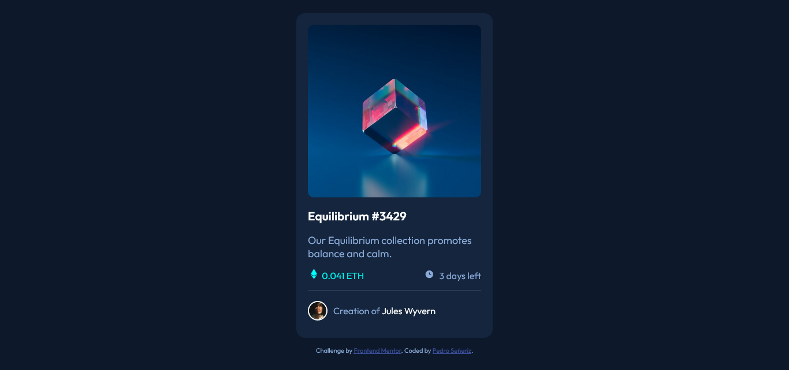

<<<<<<< HEAD
# Frontend Mentor - NFT preview card component solution
=======
>>>>>>> e012cd72cec60110787236f08756353461e9836c

This is a solution to the [NFT preview card component challenge on Frontend Mentor](https://www.frontendmentor.io/challenges/nft-preview-card-component-SbdUL_w0U). Frontend Mentor challenges help you improve your coding skills by building realistic projects. 

## Table of contents

- [Overview](#overview)
  - [The challenge](#the-challenge)
  - [Screenshot](#screenshot)
  - [Links](#links)
- [My process](#my-process)
  - [Built with](#built-with)
- [Author](#author)

**Note: Delete this note and update the table of contents based on what sections you keep.**

## Overview

### The challenge

Users should be able to:

- View the optimal layout depending on their device's screen size
- See hover states for interactive elements

### Screenshot

### Links

- Solution URL: [solution URL](https://github.com/PedroS2001/NTF-card-component-frontendmentor)
- Live Site URL: [Live site URL](https://pedros2001.github.io/NTF-card-component-frontendmentor/)

## My process

### Built with

- Semantic HTML5 markup
- SASS
- Flexbox

## Author

- LinkedIn - [Pedro Señeriz](https://www.linkedin.com/in/pedro-se%C3%B1eriz-b86166226/)
- Frontend Mentor - [@PedroS2001](https://www.frontendmentor.io/profile/PedroS2001)
- GitHub - [@PedroS2001](https://github.com/PedroS2001)
